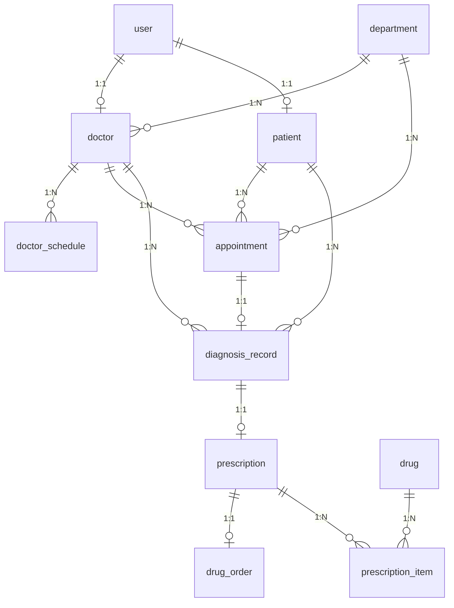
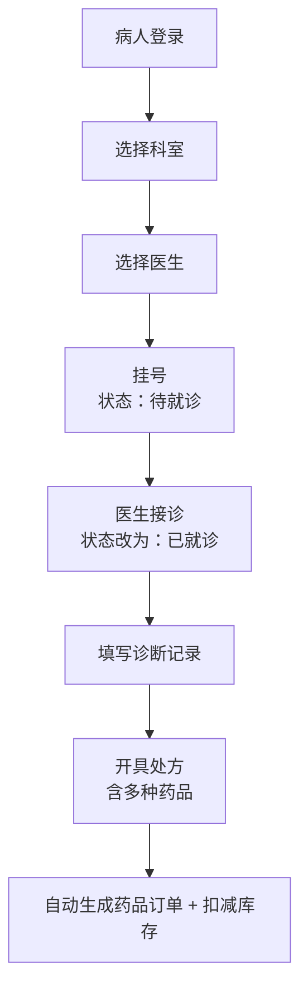
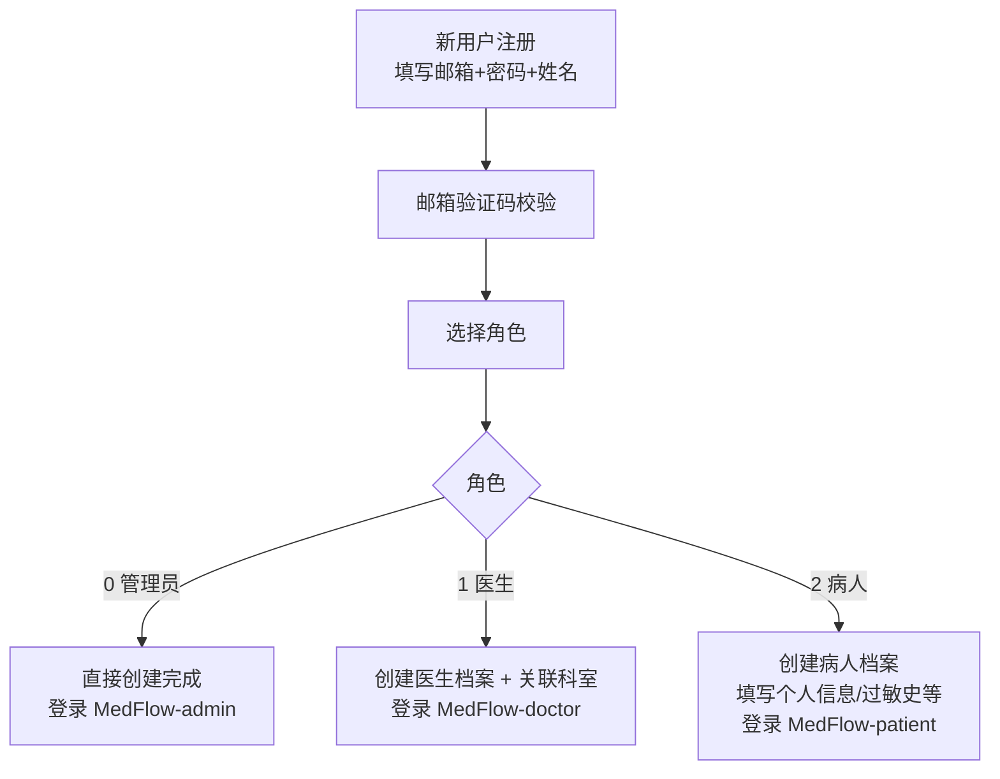
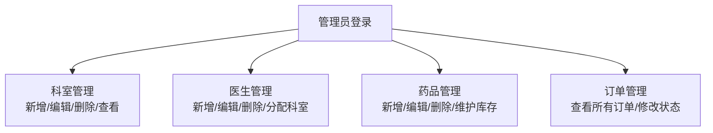

# 网上医疗记录系统（云诊易 MedFlow）— 设计文档

## 版本记录

| 版本 | 日期 | 说明 |
|------|------|------|
| v1.0 | 2026-07-08 | 初次定稿 |
| v2.0 | 2026-07-08 | 状态字段改为 TINYINT 枚举；新增处方头表；订单挂在处方上 |
| v2.1 | 2026-07-08 | department/doctor/patient/drug 新增 deleted_at 软删除字段 |

---

## 1. 项目概述

网上医疗记录系统（云诊易 MedFlow），实现病人线上挂号、医生诊断开处方、药品订单管理的一体化流程。

### 技术栈

| 层 | 技术 |
|----|------|
| 后端 | Python（框架待定），提供 RESTful API |
| 前端 | Vue3 + Element Plus，三个独立项目 |
| 数据库 | MySQL |

### 项目结构

```
MedFlow/
├── MedFlow-backend/    # 后端 API 服务
├── MedFlow-admin/      # 前端 — 管理员端（科室/医生/药品/订单管理）
├── MedFlow-doctor/     # 前端 — 医生端（接诊/诊断/开处方）
├── MedFlow-patient/    # 前端 — 病人端（挂号/查看历史/订单查询）
├── medflow.sql  # 数据库建表脚本
└── 设计文档.md          # 本文档
```

三个前端项目共用同一套后端 API，通过登录用户的 `role` 字段区分权限和可访问页面。

---

## 2. 表结构设计

### 2.1 用户表（user）

| 字段 | 类型 | 约束 | 说明 |
|------|------|------|------|
| id | BIGINT | PK, 自增 | 主键 |
| password | VARCHAR(255) | NOT NULL | 密码（加密存储） |
| name | VARCHAR(50) | NOT NULL | 姓名 |
| email | VARCHAR(100) | UNIQUE, NOT NULL | 邮箱（登录凭证） |
| phone | VARCHAR(20) | UNIQUE | 手机号（选填，填写则唯一） |
| role | TINYINT | NOT NULL | 角色：0=管理员 / 1=医生 / 2=病人 |
| status | TINYINT | NOT NULL, DEFAULT 1 | 状态：0=禁用 / 1=正常 |
| last_login | DATETIME | | 最后登录时间 |
| created_at | DATETIME | NOT NULL | 创建时间 |
| updated_at | DATETIME | NOT NULL | 修改时间 |

### 2.2 科室表（department）

| 字段 | 类型 | 约束 | 说明 |
|------|------|------|------|
| id | BIGINT | PK, 自增 | 主键 |
| name | VARCHAR(50) | NOT NULL | 名称 |
| description | VARCHAR(255) | | 描述 |
| deleted_at | DATETIME | | 软删除时间（NULL=正常） |
| created_at | DATETIME | NOT NULL | 创建时间 |
| updated_at | DATETIME | NOT NULL | 修改时间 |

### 2.3 医生表（doctor）

| 字段 | 类型 | 约束 | 说明 |
|------|------|------|------|
| id | BIGINT | PK, 自增 | 主键 |
| user_id | BIGINT | UNIQUE, FK → user.id | 用户ID（一对一） |
| department_id | BIGINT | FK → department.id | 科室ID（多对一） |
| title | VARCHAR(50) | | 职称，如主任医师 |
| introduction | VARCHAR(500) | | 简介 |
| deleted_at | DATETIME | | 软删除时间（NULL=正常） |
| created_at | DATETIME | NOT NULL | 创建时间 |
| updated_at | DATETIME | NOT NULL | 修改时间 |

### 2.4 医生排班表（doctor_schedule）

每位医生独立设置出诊时段，挂号时根据排班动态生成可选时间段。

| 字段 | 类型 | 约束 | 说明 |
|------|------|------|------|
| id | BIGINT | PK, 自增 | 主键 |
| doctor_id | BIGINT | FK → doctor.id, NOT NULL | 医生ID |
| work_date | DATE | NOT NULL | 出诊日期 |
| start_time | TIME | NOT NULL | 开始时间，如 08:00 |
| end_time | TIME | NOT NULL | 结束时间，如 12:00 |
| max_patients | INT | NOT NULL, DEFAULT 10 | 该时段最大可挂号人数 |
| status | TINYINT | NOT NULL, DEFAULT 1 | 状态：0=停诊 / 1=可预约 |
| created_at | DATETIME | NOT NULL | 创建时间 |
| updated_at | DATETIME | NOT NULL | 修改时间 |

### 2.5 病人表（patient）

| 字段 | 类型 | 约束 | 说明 |
|------|------|------|------|
| id | BIGINT | PK, 自增 | 主键 |
| user_id | BIGINT | UNIQUE, FK → user.id | 用户ID（一对一） |
| gender | TINYINT | | 性别：0=未知 / 1=男 / 2=女 |
| birth_date | DATE | | 出生日期 |
| address | VARCHAR(255) | | 居住地址 |
| blood_type | VARCHAR(10) | | 血型 |
| allergy_history | VARCHAR(500) | | 过敏史 |
| deleted_at | DATETIME | | 软删除时间（NULL=正常） |
| created_at | DATETIME | NOT NULL | 创建时间 |
| updated_at | DATETIME | NOT NULL | 修改时间 |

### 2.6 药品表（drug）

| 字段 | 类型 | 约束 | 说明 |
|------|------|------|------|
| id | BIGINT | PK, 自增 | 主键 |
| name | VARCHAR(100) | NOT NULL | 名称 |
| specification | VARCHAR(50) | | 规格，如 0.25g/片 |
| unit | VARCHAR(20) | | 单位，如 盒/瓶/支 |
| price | DECIMAL(10,2) | NOT NULL | 单价 |
| stock | INT | NOT NULL | 库存数量 |
| manufacturer | VARCHAR(100) | | 生产厂商 |
| deleted_at | DATETIME | | 软删除时间（NULL=正常） |
| created_at | DATETIME | NOT NULL | 创建时间 |
| updated_at | DATETIME | NOT NULL | 修改时间 |

### 2.7 挂号表（appointment）

| 字段 | 类型 | 约束 | 说明 |
|------|------|------|------|
| id | BIGINT | PK, 自增 | 主键 |
| patient_id | BIGINT | FK → patient.id | 病人ID |
| doctor_id | BIGINT | FK → doctor.id | 医生ID |
| department_id | BIGINT | FK → department.id | 科室ID（冗余自 doctor，方便按科室直接查挂号） |
| appointment_time | DATETIME | | 预约就诊时间 |
| status | TINYINT | NOT NULL, DEFAULT 1 | 状态：0=已取消 / 1=待就诊 / 2=已就诊 |
| created_at | DATETIME | NOT NULL | 创建时间 |
| updated_at | DATETIME | NOT NULL | 修改时间 |

### 2.8 诊断记录表（diagnosis_record）

| 字段 | 类型 | 约束 | 说明 |
|------|------|------|------|
| id | BIGINT | PK, 自增 | 主键 |
| appointment_id | BIGINT | UNIQUE, FK → appointment.id | 挂号ID（一对一） |
| doctor_id | BIGINT | FK → doctor.id | 医生ID（冗余，方便按医生查诊断历史） |
| patient_id | BIGINT | FK → patient.id | 病人ID（冗余，方便按病人查诊断历史） |
| chief_complaint | VARCHAR(500) | | 主诉，如"头痛3天" |
| diagnosis_result | VARCHAR(500) | | 诊断结果 |
| prescription_advice | VARCHAR(500) | | 医嘱 |
| created_at | DATETIME | NOT NULL | 创建时间 |
| updated_at | DATETIME | NOT NULL | 修改时间 |

### 2.9 处方表（prescription）— v2.0 新增

| 字段 | 类型 | 约束 | 说明 |
|------|------|------|------|
| id | BIGINT | PK, 自增 | 主键 |
| diagnosis_id | BIGINT | UNIQUE, FK → diagnosis_record.id | 诊断记录ID（一对一） |
| doctor_id | BIGINT | FK → doctor.id | 医生ID（冗余，方便按医生查处方） |
| patient_id | BIGINT | FK → patient.id | 病人ID（冗余，方便按病人查处方） |
| created_at | DATETIME | NOT NULL | 创建时间 |
| updated_at | DATETIME | NOT NULL | 修改时间 |

### 2.10 处方明细表（prescription_item）

| 字段 | 类型 | 约束 | 说明 |
|------|------|------|------|
| id | BIGINT | PK, 自增 | 主键 |
| prescription_id | BIGINT | FK → prescription.id | 处方ID |
| drug_id | BIGINT | FK → drug.id | 药品ID |
| quantity | INT | NOT NULL | 数量 |
| usage_method | VARCHAR(100) | | 用法，如"一日三次，一次一片" |
| days | INT | | 天数 |
| created_at | DATETIME | NOT NULL | 创建时间 |
| updated_at | DATETIME | NOT NULL | 修改时间 |

### 2.11 药品订单表（drug_order）

| 字段 | 类型 | 约束 | 说明 |
|------|------|------|------|
| id | BIGINT | PK, 自增 | 主键 |
| prescription_id | BIGINT | UNIQUE, FK → prescription.id | 处方ID（一对一） |
| total_amount | DECIMAL(10,2) | | 总金额 |
| status | TINYINT | NOT NULL, DEFAULT 1 | 状态：0=已取消 / 1=待取药 / 2=已取药 |
| created_at | DATETIME | NOT NULL | 创建时间 |
| updated_at | DATETIME | NOT NULL | 修改时间 |

---

## 3. 软删除策略 (v2.1)

系统中并非所有表都使用 `deleted_at`，而是按数据性质分为三类处理：

### 3.1 使用 `deleted_at` 的字典/档案表

这些表被业务数据外键引用，实体"删除"后历史数据仍需追溯。`deleted_at` 用 `DATETIME`，NULL 表示正常，非 NULL 记录删除时刻。

| 表 | 删除场景 | 为什么不能物理删除 |
|----|----------|-------------------|
| `department` | 科室撤销 | `appointment`、`diagnosis_record`、`prescription` 的科室字段不能断链 |
| `doctor` | 医生离职 | `appointment`、`diagnosis_record`、`prescription` 的医生字段必须可追溯 |
| `patient` | 病人注销 | 医疗法规要求就诊数据最低保留年限，`diagnosis_record` 等不可断链 |
| `drug` | 药品停产下架 | `prescription_item` 中历史处方明细的药品引用不能断链 |

查询模板：`WHERE deleted_at IS NULL`（仅查有效数据），需要历史追溯时不加此条件。

### 3.2 用 `status` 字段覆盖的表

这些表有明确的生命周期状态，"删除"本质上是状态流转的一环。

| 表 | 现有字段 | 说明 |
|----|----------|------|
| `user` | `status`：0=禁用 | 禁用用户即等价于软删除，阻止登录 |
| `appointment` | `status`：0=已取消 | 取消挂号等价于软删除，保留历史记录 |
| `doctor_schedule` | `status`：0=停诊 | 排班停用等价于软删除，保留历史排班记录 |
| `drug_order` | `status`：0=已取消 | 取消订单等价于软删除，保留财务记录 |

### 3.3 不允许删除的表

| 表 | 原因 |
|----|------|
| `diagnosis_record` | 诊断记录不可删除。允许修改（通过操作日志保留每次修改的历史） |
| `prescription` | 处方不可删除。允许修改（仅限对应订单未取药时，修改记录写入操作日志） |
| `prescription_item` | 随处方存在，无独立删除场景 |

---

## 4. 表间关系

### 4.1 一对一关系

| 左表 | 右表 | 外键位置 | 说明 |
|------|------|----------|------|
| user | doctor | doctor.user_id → user.id | 一个用户对应一个医生 |
| user | patient | patient.user_id → user.id | 一个用户对应一个病人 |
| appointment | diagnosis_record | diagnosis_record.appointment_id → appointment.id | 一次挂号对应一次诊断 |
| diagnosis_record | prescription | prescription.diagnosis_id → diagnosis_record.id | 一次诊断对应一张处方 |
| prescription | drug_order | drug_order.prescription_id → prescription.id | 一张处方对应一笔订单 |

### 4.2 一对多关系

| 左表(1) | 右表(n) | 外键位置 | 说明 |
|---------|---------|----------|------|
| department | doctor | doctor.department_id → department.id | 一个科室有多个医生 |
| doctor | doctor_schedule | doctor_schedule.doctor_id → doctor.id | 一个医生有多个排班时段 |
| department | appointment | appointment.department_id → department.id | 一个科室有多条挂号 |
| doctor | appointment | appointment.doctor_id → doctor.id | 一个医生被多人挂号 |
| patient | appointment | appointment.patient_id → patient.id | 一个病人可挂多次号 |
| doctor | diagnosis_record | diagnosis_record.doctor_id → doctor.id | 一个医生有多条诊断 |
| patient | diagnosis_record | diagnosis_record.patient_id → patient.id | 一个病人有多条诊断 |
| doctor | prescription | prescription.doctor_id → doctor.id | 一个医生有多张处方 |
| patient | prescription | prescription.patient_id → patient.id | 一个病人有多张处方 |
| prescription | prescription_item | prescription_item.prescription_id → prescription.id | 一张处方包含多种药品 |
| drug | prescription_item | prescription_item.drug_id → drug.id | 一种药出现在多个处方中 |

### 4.3 多对多关系（通过中间表实现）

| 左表 | 中间表 | 右表 | 说明 |
|------|--------|------|------|
| patient | appointment | doctor | 病人 ↔ 医生（挂号实现） |
| prescription | prescription_item | drug | 处方 ↔ 药品（处方明细实现） |

### 4.4 关系总图



---

## 5. 业务流程

### 5.1 看病取药流程



**病人查询路径：**
- 挂号历史：`appointment WHERE patient_id = ?`
- 诊断历史：`diagnosis_record WHERE patient_id = ?`
- 处方历史：`prescription WHERE patient_id = ?`
- 药品订单：`drug_order JOIN prescription WHERE patient_id = ?`

**医生查询路径：**
- 挂号历史：`appointment WHERE doctor_id = ?`
- 诊断历史：`diagnosis_record WHERE doctor_id = ?`
- 处方历史：`prescription WHERE doctor_id = ?`
- 药品订单：`drug_order JOIN prescription WHERE doctor_id = ?`

### 5.2 注册流程



### 5.3 管理流程（MedFlow-admin 管理员端）



### 5.4 看病取药流程（MedFlow-patient + MedFlow-doctor）

---

## 6. TINYINT 枚举速查表

| 表 | 字段 | 值 | 含义 |
|----|------|----|------|
| user | role | 0 | 管理员 |
| user | role | 1 | 医生 |
| user | role | 2 | 病人 |
| user | status | 0 | 禁用 |
| user | status | 1 | 正常 |
| patient | gender | 0 | 未知 |
| patient | gender | 1 | 男 |
| patient | gender | 2 | 女 |
| appointment | status | 0 | 已取消 |
| appointment | status | 1 | 待就诊 |
| appointment | status | 2 | 已就诊 |
| drug_order | status | 0 | 已取消 |
| drug_order | status | 1 | 待取药 |
| drug_order | status | 2 | 已取药 |

---

## 7. 接口概览

| 模块 | 接口 | 使用者 |
|------|------|--------|
| 用户 | 邮箱注册、邮箱验证码登录、获取用户信息、修改信息 | 三个前端共用 |
| 科室 | 科室列表、新增、编辑、删除 | MedFlow-admin |
| 医生 | 医生列表（按科室）、新增、编辑、删除 | MedFlow-admin；MedFlow-patient 挂号时查医生列表 |
| 病人 | 病人列表、新增、编辑、删除 | MedFlow-admin |
| 药品 | 药品列表、新增、编辑、删除、库存调整 | MedFlow-admin；MedFlow-doctor 开处方时查药品 |
| 排班 | 设置/修改/删除排班 | MedFlow-admin 管理排班；MedFlow-patient 挂号时查可用时段 |
| 挂号 | 挂号、取消挂号、列表（按病人/按医生/按科室）、状态修改 | MedFlow-patient 挂号查历史；MedFlow-doctor 看挂号列表 |
| 诊断记录 | 新增、编辑、列表（按医生/按病人/按挂号）、详情 | MedFlow-doctor 写诊断；MedFlow-patient 查历史 |
| 处方 | 新增、编辑、列表（按医生/按病人）、详情 | MedFlow-doctor 开处方；MedFlow-patient 查处方 |
| 处方明细 | 根据处方ID获取药品列表 | 三个前端均可能使用 |
| 药品订单 | 列表（按病人/按医生/全部）、状态修改 | MedFlow-patient 查订单；MedFlow-doctor 查处方对应订单；MedFlow-admin 管订单 |

---

## 8. 外键汇总表

| 表 | 外键字段 | 指向表 | 关系类型 |
|----|----------|--------|----------|
| doctor | user_id | user | 一对一 |
| doctor | department_id | department | 多对一 |
| doctor_schedule | doctor_id | doctor | 多对一 |
| patient | user_id | user | 一对一 |
| appointment | patient_id | patient | 多对一 |
| appointment | doctor_id | doctor | 多对一 |
| appointment | department_id | department | 多对一 |
| diagnosis_record | appointment_id | appointment | 一对一 |
| diagnosis_record | doctor_id | doctor | 多对一 |
| diagnosis_record | patient_id | patient | 多对一 |
| prescription | diagnosis_id | diagnosis_record | 一对一 |
| prescription | doctor_id | doctor | 多对一 |
| prescription | patient_id | patient | 多对一 |
| prescription_item | prescription_id | prescription | 多对一 |
| prescription_item | drug_id | drug | 多对一 |
| drug_order | prescription_id | prescription | 一对一 |

---

## 9. 全系统表总览（v2.2）

### 9.1 业务表（11 张）— `medflow.sql`

| # | 表名 | 职责 | 核心逻辑 |
|------|------|------|------|
| 1 | `user` | 统一登录入口 | email+password 登录，role 区分管理员/医生/病人，status 控制启用/禁用 |
| 2 | `department` | 科室字典 | 管理员维护，软删除（deleted_at），历史数据不断链 |
| 3 | `doctor` | 医生档案 | 1:1 关联 user，N:1 关联 department，软删除 |
| 4 | `doctor_schedule` | 医生排班 | 管理员为每位医生设置出诊日期+时段+限号数，挂号时动态生成可选时段 |
| 5 | `patient` | 病人档案 | 1:1 关联 user，存性别/出生/地址/血型/过敏史，软删除 |
| 6 | `drug` | 药品字典 | 名称/规格/单价/库存/厂家，软删除 |
| 7 | `appointment` | 挂号 | 病人选科室→选医生→选排班时段→挂号。status 流转：待就诊→已就诊/已取消 |
| 8 | `diagnosis_record` | 诊断记录 | 挂号已就诊后医生填写，1:1 关联 appointment。可修改不可删除 |
| 9 | `prescription` | 处方头 | 1:1 关联诊断记录。一次诊断一张处方。可修改不可删除 |
| 10 | `prescription_item` | 处方明细 | 处方↔药品 M:N 中间表。修改时先删后插，操作日志保留旧值 |
| 11 | `drug_order` | 药品订单 | 1:1 关联处方。total_amount=∑(item.quantity×drug.price)。status 流转：待取药→已取药/已取消 |

### 9.2 功能表（7 张）— `medflow_func.sql`

| # | 表名 | 职责 | 核心逻辑 |
|------|------|------|------|
| F1 | `audit_log` | 操作审计 | 认证+增删改+隐私访问 33 种 action 全覆盖，old_value/new_value JSON 存变更快照。不设外键 |
| F2 | `verification_code` | 邮箱验证码 | 发送、校验（5分钟有效+3次重试上限+IP 频率限制）、定时清理 |
| F3 | `system_config` | 系统配置 | 键值对存运行时参数，后端启动加载到内存，管理员前端编辑 |
| F4 | `data_dict` | 数据字典 | 统一翻译 TINYINT 枚举（6种类型 15条数据），前后端统一读取 |
| F5 | `token_blacklist` | 登出令牌 | JWT 的 jti 写入此表，校验拦截，实现无状态 token 的真正登出 |
| F6 | `file_attachment` | 文件附件 | 仅限图片/视频，存本地磁盘。uploader_id+role 定位上传人，related_type+id 关联业务记录 |
| F7 | `notification` | 通知消息 | 9 种自动触发场景（挂号/诊疗/系统），is_read 标记已读，related_type+id 支持点击跳转 |

### 9.3 业务数据流（端到端）

```
1. 注册/登录
   user ──→ verification_code（邮箱验证）──→ data_dict（渲染角色选择）
   ──→ doctor / patient（根据角色创建档案）

2. 管理员配置
   department ──→ doctor（分配科室）──→ doctor_schedule（设置排班）
   ──→ drug（维护药品库存）──→ system_config（调整参数）

3. 病人挂号
   department（选科室）──→ doctor（选医生）──→ doctor_schedule（选时段）
   ──→ appointment（挂号）──→ notification（通知医生）

4. 医生接诊
   appointment（待就诊→已就诊）──→ diagnosis_record（写诊断）
   ──→ prescription（开处方）──→ prescription_item（选多种药品）
   ──→ drug_order（生成订单）──→ notification（通知病人）

5. 取药
   drug_order（待取药→已取药）──→ drug.stock（扣减库存）
   ──→ notification（通知病人）

6. 审计贯穿全程
   audit_log（每个关键操作记录）──→ token_blacklist（登出拦截）
   file_attachment（上传检查报告，挂到诊断/处方上）
```

### 9.4 软删除策略总表

| 策略 | 表 | 方式 |
|------|------|------|
| `deleted_at` | department, doctor, patient, drug | DATETIME，NULL=正常 |
| `status` 字段 | user, doctor_schedule, appointment, drug_order | TINYINT 状态值覆盖删除 |
| 不可删除 | diagnosis_record, prescription, prescription_item | 医疗文书合规要求 |

### 9.5 操作日志覆盖（32 种 action）

| 分类 | 数量 | 覆盖 |
|------|------|------|
| 认证安全 | 5 | 登录成功/失败、修改密码、禁用/启用用户 |
| 科室 | 3 | 新增/编辑/删除 |
| 医生 | 3 | 新增/编辑/删除 |
| 病人 | 3 | 新增/编辑/删除 |
| 药品 | 4 | 新增/编辑/删除 + 调整库存 |
| 排班 | 3 | 新增/编辑/删除 |
| 挂号 | 3 | 挂号/修改/取消 |
| 诊断 | 2 | 新增/修改 |
| 处方 | 2 | 新增/修改 |
| 文件 | 2 | 上传/删除 |
| 订单 | 1 | 取消订单 |
| 隐私访问 | 3 | 查看诊断/处方/订单 |

**总原则：以上操作一经发生，不论操作人是管理员、医生还是病人，同步写入 audit_log。**
